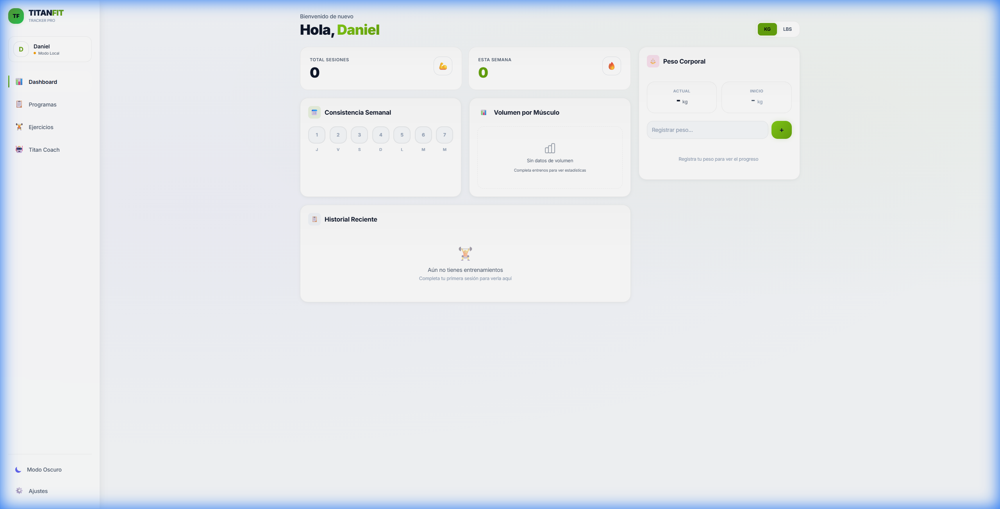
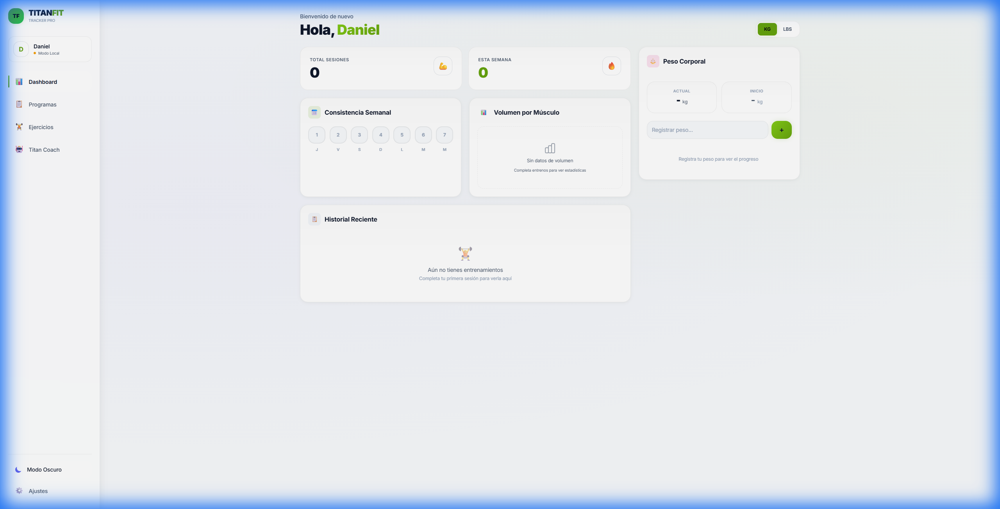
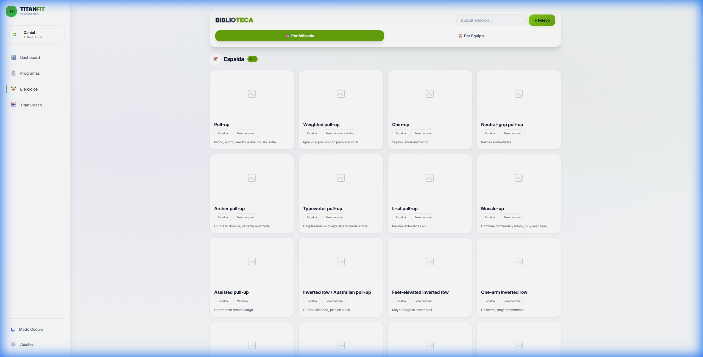
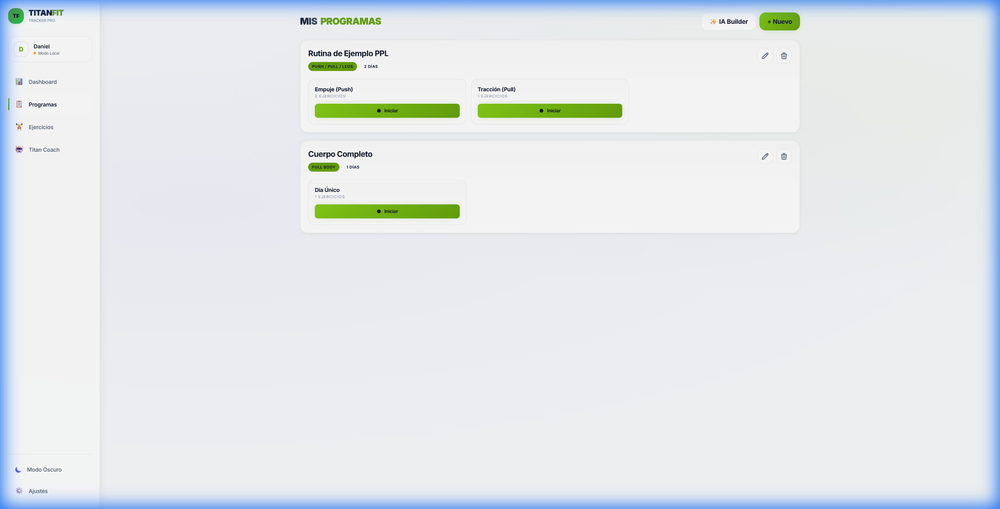

<p align="center">
  
</p>

<h1 align="center">💪 TitanFitness Tracker</h1>

<p align="center">
  <strong>Tu compañero inteligente de entrenamiento con IA integrada</strong>
</p>

<p align="center">
  
  
  
  
  
</p>

---

## 📖 Descripción

**TitanFitness Tracker** es una aplicación web progresiva (PWA) diseñada para atletas y entusiastas del fitness que buscan llevar un registro detallado de sus entrenamientos. Con una interfaz moderna y un asistente de IA integrado, la app te ayuda a planificar, ejecutar y analizar tu progreso de forma inteligente.

---

## ✨ Características Principales

| Característica                  | Descripción                                                                           |
| ------------------------------- | ------------------------------------------------------------------------------------- |
| 📊 **Dashboard Analítico**      | Visualiza tu progreso con estadísticas, gráficas de rendimiento y métricas corporales |
| 🏋️ **Biblioteca de Ejercicios** | +28 ejercicios predefinidos con descripciones, organizados por músculo y equipo       |
| 📋 **Constructor de Rutinas**   | Crea programas personalizados con múltiples días y ejercicios                         |
| 🤖 **Titan Coach (IA)**         | Asistente inteligente powered by Gemini AI para consejos personalizados               |
| ⏱️ **Temporizador de Descanso** | Timer integrado con alertas para optimizar tus pausas                                 |
| 🔢 **Calculadora de Discos**    | Calcula la distribución de placas en tu barra (kg/lbs)                                |
| ☁️ **Sincronización Cloud**     | Guarda tu progreso en Supabase y accede desde cualquier dispositivo                   |
| 🌓 **Modo Claro/Oscuro**        | Interfaz adaptable a tus preferencias visuales                                        |
| 📱 **PWA Instalable**           | Instala como app nativa en móvil o escritorio                                         |

---

## 📸 Capturas de Pantalla

<details>
<summary><strong>🖼️ Ver Galería</strong></summary>

### Dashboard (Modo Oscuro)


### Dashboard (Modo Claro)



### Biblioteca de Ejercicios



### Programas de Entrenamiento



</details>

---

## 🛠️ Stack Tecnológico

```
Frontend:     React 19 + TypeScript + Vite
Estilos:      CSS Variables + Design System personalizado
Backend:      Supabase (Auth + Database + Storage)
IA:           Google Gemini 2.5 Flash
PWA:          Service Workers + Web Manifest
```

---

## 🚀 Instalación

### Prerequisitos

- Node.js v18 o superior
- npm o yarn
- Cuenta de Supabase (opcional, para sincronización)
- API Key de Gemini (opcional, para IA)

### Pasos

1. **Clonar el repositorio**

   ```bash
   git clone https://github.com/tu-usuario/titanfitness-tracker.git
   cd titanfitness-tracker
   ```

2. **Instalar dependencias**

   ```bash
   npm install
   ```

3. **Configurar variables de entorno**

   ```bash
   cp .env.example .env.local
   ```

   Edita `.env.local` con tus credenciales:

   ```env
   VITE_GEMINI_API_KEY=tu_api_key_de_gemini

   VITE_SUPABASE_URL=https://tu-proyecto.supabase.co
   VITE_SUPABASE_ANON_KEY=tu_anon_key
   ```

4. **Ejecutar en desarrollo**

   ```bash
   npm run dev
   ```

5. **Construir para producción**
   ```bash
   npm run build
   ```

---

## 📁 Estructura del Proyecto

```
titanfitness-tracker/
├── components/          # Componentes React
│   ├── Dashboard.tsx    # Panel principal con estadísticas
│   ├── ExerciseLibrary.tsx  # Biblioteca de ejercicios
│   ├── RoutineBuilder.tsx   # Constructor de rutinas
│   ├── AiCoach.tsx      # Asistente IA
│   ├── RestTimer.tsx    # Temporizador de descanso
│   └── ...
├── services/            # Servicios externos
│   ├── supabaseService.ts   # Configuración Supabase
│   └── geminiService.ts     # Integración Gemini AI
├── screenshots/         # Capturas para README
├── App.tsx              # Componente principal
├── types.ts             # Definiciones TypeScript
├── constants.ts         # Ejercicios y rutinas iniciales
├── index.css            # Sistema de diseño CSS
└── vite.config.ts       # Configuración de Vite
```

---

## 🔒 Seguridad

- ✅ Las credenciales sensibles se almacenan en `.env.local` (excluido de git)
- ✅ Supabase Auth para manejo seguro de sesiones
- ✅ Row Level Security (RLS) para proteger datos de usuario
- ✅ Datos del usuario encriptados en tránsito
- ✅ Modo invitado disponible (datos locales sin cloud)

---

## 📄 Licencia

Este proyecto está bajo la Licencia MIT. Consulta el archivo [LICENSE](LICENSE) para más detalles.

---

## 🤝 Contribuir

Las contribuciones son bienvenidas. Por favor:

1. Haz fork del proyecto
2. Crea una rama para tu feature (`git checkout -b feature/nueva-caracteristica`)
3. Haz commit de tus cambios (`git commit -m 'Agrega nueva característica'`)
4. Push a la rama (`git push origin feature/nueva-caracteristica`)
5. Abre un Pull Request

---

<p align="center">
  Hecho con ❤️ por Daniel
</p>
